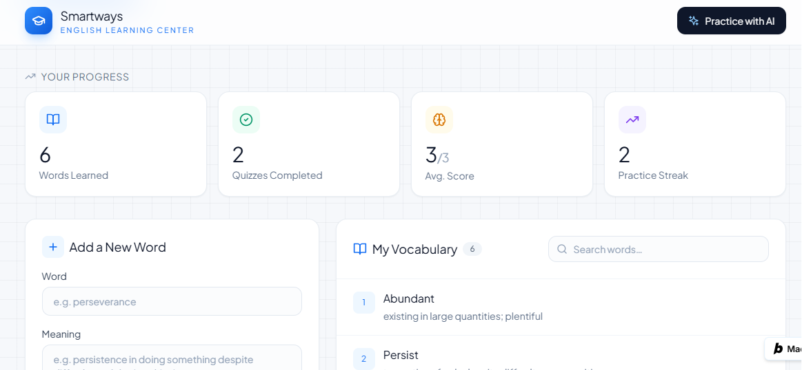

# Smartways Practice Portal

An AI-powered vocabulary practice app for students at **Smartways English Learning Center**.

## The Problem

Students at Smartways learn new English vocabulary in class but have no easy way to review or practice those words at home between lessons. This leads to forgotten vocabulary and slower progress. This app gives students a simple place to save the words they learn and instantly practice them with AI-generated quizzes — reinforcing what they learned in class, anytime.

**Who it's for:** English language students at Smartways English Learning Center (and similar language learners generally).

## Live Demo

🔗 **[https://smartways-english-le-g9j4.bolt.host](https://smartways-english-le-g9j4.bolt.host)**

## Features

- **Add vocabulary words** — students save new words with their meanings as they learn them in class
- **Word dashboard** — view all saved words in one place
- **AI-generated practice quiz** — click "Practice with AI" to generate a short 3-question quiz (fill-in-the-blank and sentence-correction) built from the student's own saved words
- **Instant AI feedback** — after answering, students get immediate feedback explaining whether their answer was correct and why
- **Progress tracking** — see total words learned and quizzes completed over time

## The AI Feature

The core AI feature is the **"Practice with AI"** quiz generator. When a student clicks it, their saved vocabulary words are sent to an AI model, which generates a short, original quiz using those exact words in new sentences — then evaluates the student's answers and gives feedback.

**System prompt used:**
> "You are a friendly English language tutor for a learning center. Given a list of vocabulary words a student has learned, generate exactly 3 short practice questions (fill-in-the-blank or sentence correction) using those words. After the student answers, give brief, encouraging feedback and correct any mistakes clearly."

## Tools, Services & AI Models Used

- **[bolt.new](https://bolt.new)** — AI app builder used to build and deploy the app
- **Supabase Edge Functions** — serverless backend hosting the AI quiz-generation logic
- **Groq API** (`llama-3.3-70b-versatile`) — the LLM powering the quiz generation and feedback
- **GitHub** — version control and public code hosting
- **Bolt Hosting** — live deployment

## Screenshots

**Homepage / Dashboard**





**App Overview**


**Practice Quiz**


**Quiz Results**


## How to Run This Project Locally

1. Clone this repository:
   ```
   git clone https://github.com/mumar5339-ship-A1/SmartwaysEnglish.git
   cd SmartwaysEnglish
   ```
2. Install dependencies:
   ```
   npm install
   ```
3. Set up environment variables — create a `.env` file with your Supabase project details and add your `GROQ_API_KEY` as a secret in your Supabase Edge Function settings.
4. Run the development server:
   ```
   npm run dev
   ```
5. Open the local URL shown in your terminal.

---

Built as a final project for a no-code AI app development course, using bolt.new.
